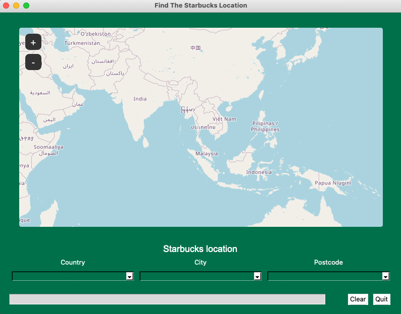
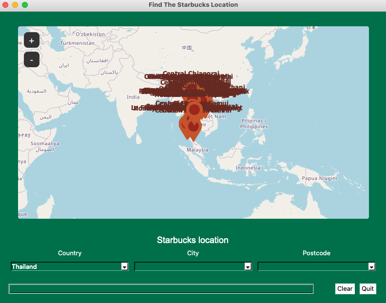
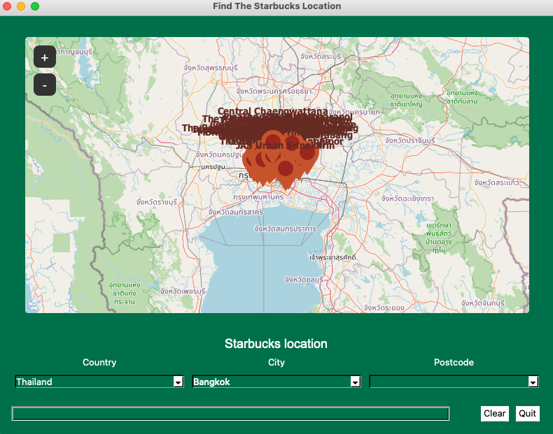
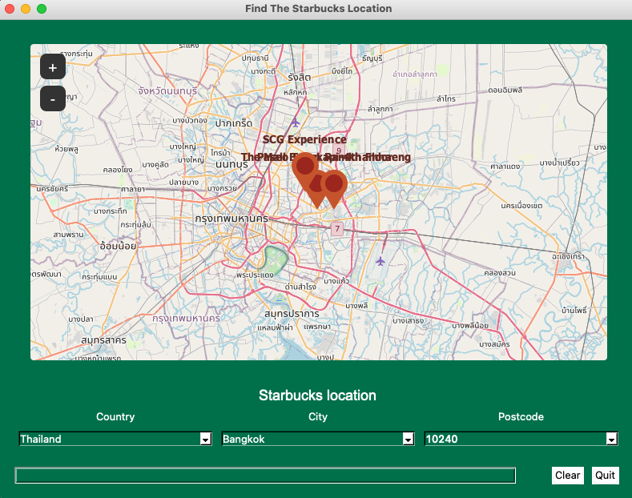
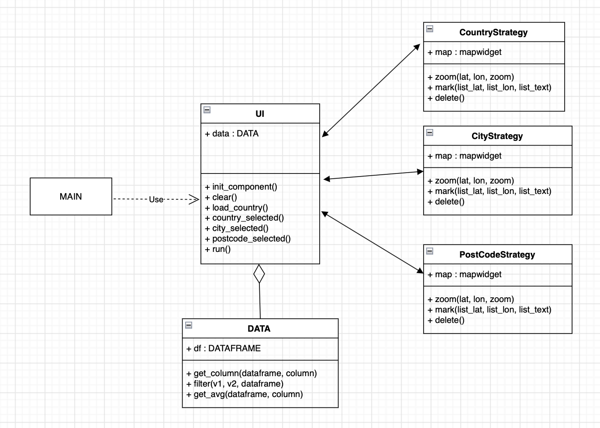
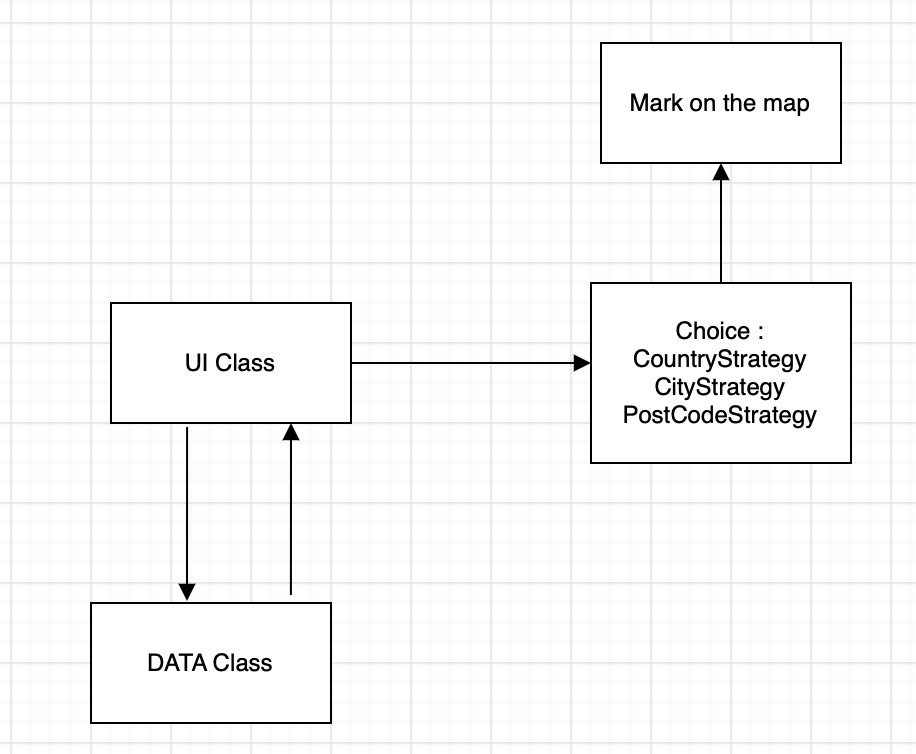
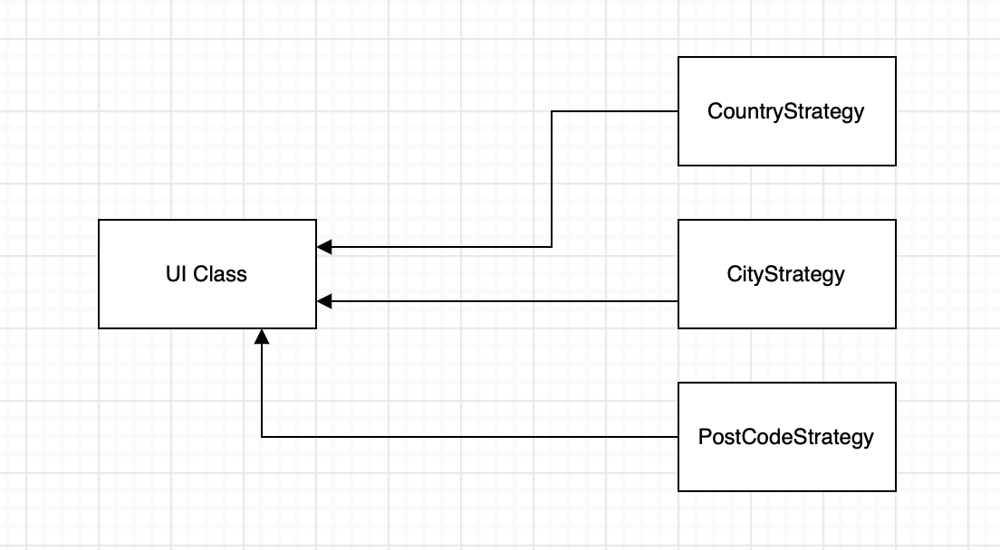
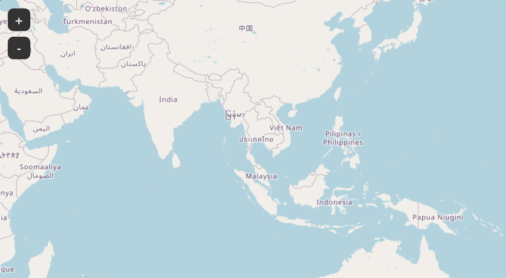

# Find The Starbucks Location

what would it be if we could easily locate a Starbucks location? So, I made this project to find the starbucks location

## Description

This project use for find the Starbucks location that you want, to find a Starbuck, the user can select a country, then
a city, and finally select a post code whatever you want. When you select a country, city or post code, the Starbucks
location will be plotted on the map with the store name and displayed on the screen (just your location that you
selected), and you can zoom in and zoom out to see the detail.

The country selected :

The city selected :

The post code selected :

## Running the Application

You should use `Python version 3.9` or more.

The package that you need to install :

`pip3 install tkintermapview`

`pip3 install pyperclip`

`pip3 install pandas`

`pip3 install numpy`

`pip3 install Pillow`

So, you can run this program in `main.py`

## Design

So basically for my overall design in this project. I use data from a csv file and then send the data to create a mark
on the map.

Find the starbucks location UML class diagram :

From that you can see in UML. UI class is the main class that bring the data from DATA class then use for create any
component and send the data to Country,City and Postcode class to create the marker to plot on the map also.

## Design Patterns Used

Design patterns that used in this project :

* `MVC design pattern` or Model–view–controller (MVC) So basically, this pattern is design pattern that have three
  element 1.Model 2.View 3.Controller. The controller(`UI class`) will request the model(`DATA class`) for the data, and
  the model will(`DATA class`) send the data to the controller(`UI class`), and the controller(`UI class`) will send the
  data to the view(`CountryStrategy, CityStrategy, PostCodeStrategy`) for plot the marker on the screen.

* `Strategy design pattern` In this project I create country, city, postcode as a strategy to choose which one that you
  want to use that make me can change the strategy any time when the program running.

## Other Information

In this project I use `tkintermapview` that make me can bring the map to displayed on the screen, and the map can zoom in
and zoom out to see the detail.

For example :

`self.map_widget = TkinterMapView(self.frame_map, corner_radius=9)`

`self.map_widget.grid(row=0, column=0, sticky=tk.NSEW, padx=20, pady=20)`

